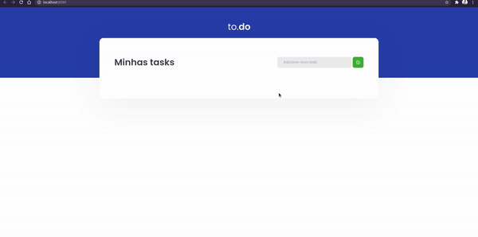
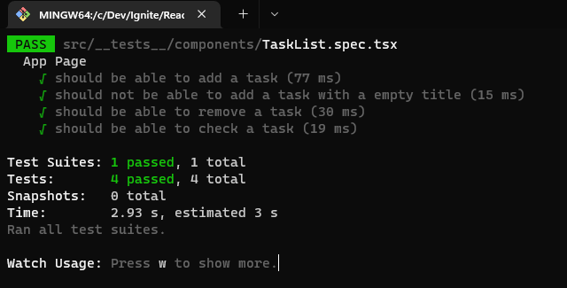

# Desafio 01 - Rocketseat Ignite - React

## 👨‍💻 Sobre este repositório

Esse repositório contém uma pequena aplicação de lista de tarefas. O código dessa aplicação é baseado em um template que pode ser acessado [aqui](https://github.com/rocketseat-education/ignite-template-reactjs-conceitos-do-react).

O projeto é parte dos execícios do curso Ignite da Rocketseat e faz parte da trilha de React. Nesse desafio o objetivo é praticar os fundamentos do React trabalhando com estados e estrutura de dados da aplicação.

Ao fim da implementação testes automatizados verificam se cada requisito foi atendido com sucesso.

O resultado esperado no exercício pode ser visto na demonstração abaixo:

## 💻 Sobre o desafio
 
 Esta é uma pequena aplicação de atividades a fazer, para treinar um pouco mais sobre manipulação do estado no React.

 O objetivo é implementar as funções abaixo, presentes no arquivo `src/components/TaskList.tsx;`

- Adicionar uma nova tarefa
- Remover uma tarefa
- Marcar e desmarcar uma tarefa como concluída

Ao concluir, no terminal, execute o comando `yarn test` para validar se os requisitos dos testes automatizados foram satisfeitos.

O esperado é que os testes passem e você receba no terminal retorno semelhante ao visto abaixo: 

